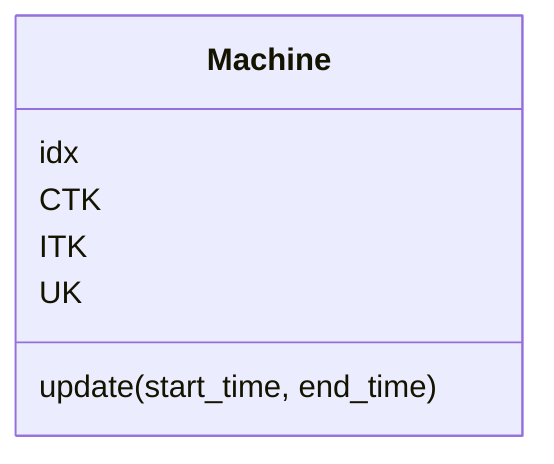

## Definition

- state: 7 [U_ave, U_std, CRO_ave, CRJ_ave, CRJ_std, Tard_e, Tard_a]
- action: 6 [rule1, rule2, rule3, rule4, rule5, rule6]
- reward:

## Code design

### Enviroment

### Jsp

## Machine

$$
UK = \frac{\sum_{i=1}^{n}\sum_{j=1}^{OP_i(t)}t_{ijk}X_{ijk}}{CTK}=1-\frac{ITK}{CTK}
$$

## Reference

1. [Tensorflow2.0|基于深度强化学习（DQN）实现动态柔性作业车间调度问题（DFJSP）](https://blog.csdn.net/crazy_girl_me/article/details/118694032?spm=1001.2014.3001.5501)
2. https://stackoverflow.com/questions/47036246/dqn-q-loss-not-converging